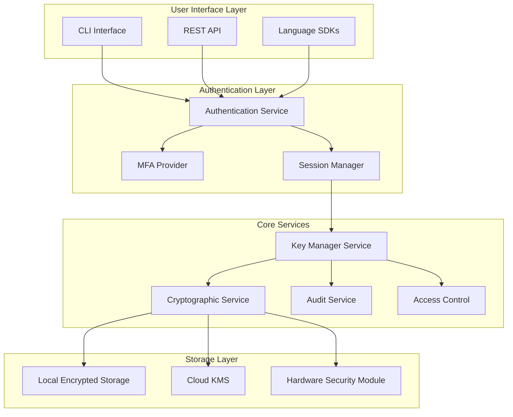
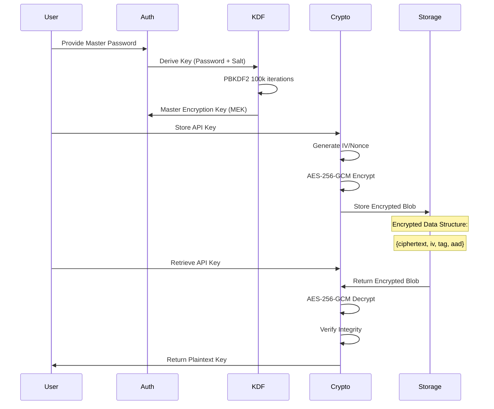
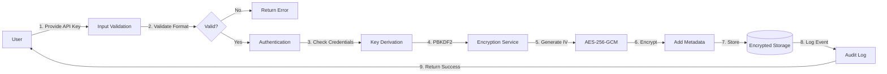
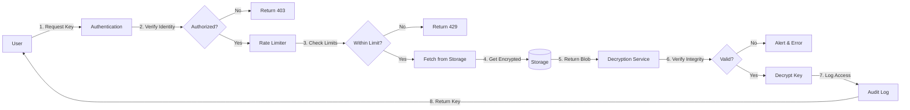
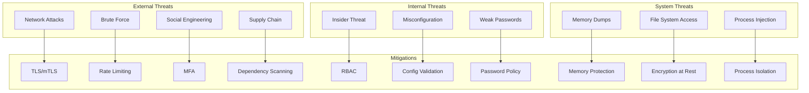
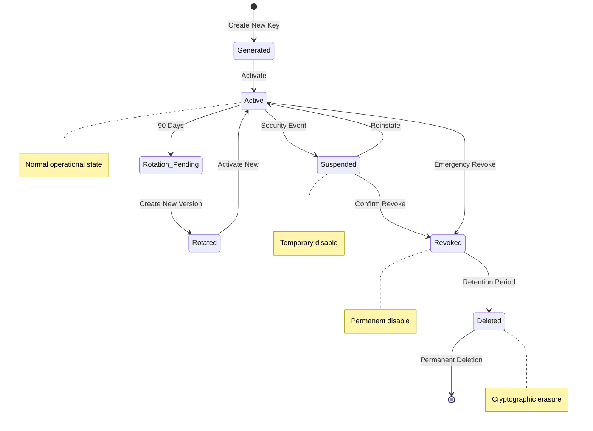

# Secure API Key Storage Architecture Diagrams

## 1. High-Level System Architecture



## 2. Encryption Flow Diagram



## 3. Key Hierarchy Diagram

```
                    Master Password (User Input)
                            │
                            ▼
                    ┌───────────────┐
                    │    PBKDF2     │
                    │  (100k iter)  │
                    └───────┬───────┘
                            │
                    Master Key (256-bit)
                            │
        ┌───────────────────┼───────────────────┐
        ▼                   ▼                   ▼
┌──────────────┐   ┌──────────────┐   ┌──────────────┐
│ Encryption   │   │ Authentication│   │  Integrity   │
│   Key (KEK)  │   │      Key     │   │     Key      │
└──────┬───────┘   └──────────────┘   └──────┬───────┘
       │                                      │
       ▼                                      ▼
┌──────────────┐                      ┌──────────────┐
│  Encrypt API │                      │   Generate   │
│     Keys     │                      │     HMAC     │
└──────────────┘                      └──────────────┘
```

## 4. Storage Architecture

```
┌─────────────────────────────────────────────────────────┐
│                    Application                          │
└─────────────────────────────────────────────────────────┘
                            │
                            ▼
┌─────────────────────────────────────────────────────────┐
│                 Storage Abstraction Layer               │
├─────────────────────────────────────────────────────────┤
│  ┌─────────────┐  ┌─────────────┐  ┌─────────────┐    │
│  │   Storage   │  │   Storage   │  │   Storage   │    │
│  │   Adapter   │  │   Adapter   │  │   Adapter   │    │
│  │   (Local)   │  │   (Cloud)   │  │    (HSM)    │    │
│  └──────┬──────┘  └──────┬──────┘  └──────┬──────┘    │
└─────────┼──────────────────┼──────────────────┼────────┘
          │                  │                  │
          ▼                  ▼                  ▼
┌─────────────────┐ ┌─────────────────┐ ┌─────────────────┐
│  Local SQLite   │ │   AWS KMS /     │ │  Hardware       │
│   (SQLCipher)   │ │  Azure KeyVault │ │  Security       │
│                 │ │  Google Cloud   │ │  Module         │
│ ~/.config/keys  │ │      KMS        │ │                 │
└─────────────────┘ └─────────────────┘ └─────────────────┘
```

## 5. Security Zones and Trust Boundaries

```
┌─────────────────────────────────────────────────────────────┐
│                     Untrusted Zone                          │
│  ┌──────────────────────────────────────────────────────┐  │
│  │              User Input / External APIs               │  │
│  └──────────────────────────────────────────────────────┘  │
└─────────────────────────────────────────────────────────────┘
                              │
                    ══════════╧═══════════  Trust Boundary
                              │
┌─────────────────────────────────────────────────────────────┐
│                    Semi-Trusted Zone                        │
│  ┌──────────────────────────────────────────────────────┐  │
│  │          Input Validation & Sanitization              │  │
│  └──────────────────────────────────────────────────────┘  │
│  ┌──────────────────────────────────────────────────────┐  │
│  │              Authentication Layer                     │  │
│  └──────────────────────────────────────────────────────┘  │
└─────────────────────────────────────────────────────────────┘
                              │
                    ══════════╧═══════════  Trust Boundary
                              │
┌─────────────────────────────────────────────────────────────┐
│                      Trusted Zone                           │
│  ┌──────────────────────────────────────────────────────┐  │
│  │            Cryptographic Operations                   │  │
│  └──────────────────────────────────────────────────────┘  │
│  ┌──────────────────────────────────────────────────────┐  │
│  │              Secure Key Storage                       │  │
│  └──────────────────────────────────────────────────────┘  │
│  ┌──────────────────────────────────────────────────────┐  │
│  │                Audit Logging                          │  │
│  └──────────────────────────────────────────────────────┘  │
└─────────────────────────────────────────────────────────────┘
```

## 6. Data Flow for API Key Operations

### 6.1 Key Storage Flow



### 6.2 Key Retrieval Flow



## 7. Component Interaction Diagram

```
┌──────────────────┐     ┌──────────────────┐     ┌──────────────────┐
│   CLI Client     │     │   Web Client     │     │   API Client     │
└────────┬─────────┘     └────────┬─────────┘     └────────┬─────────┘
         │                        │                          │
         └────────────────────────┴──────────────────────────┘
                                 │
                                 ▼
                    ┌─────────────────────────┐
                    │    Load Balancer       │
                    └─────────────────────────┘
                                 │
                    ┌────────────┴────────────┐
                    ▼                         ▼
         ┌──────────────────┐      ┌──────────────────┐
         │  API Server #1   │      │  API Server #2   │
         └──────────────────┘      └──────────────────┘
                    │                         │
                    └────────────┬────────────┘
                                 │
                    ┌────────────┴────────────┐
                    ▼                         ▼
         ┌──────────────────┐      ┌──────────────────┐
         │  Redis Cache     │      │  Message Queue   │
         └──────────────────┘      └──────────────────┘
                                              │
                    ┌─────────────────────────┴───┐
                    ▼                             ▼
         ┌──────────────────┐          ┌──────────────────┐
         │  Key Manager     │          │  Audit Service   │
         │    Service       │          │                  │
         └────────┬─────────┘          └────────┬─────────┘
                  │                              │
                  ▼                              ▼
         ┌──────────────────┐          ┌──────────────────┐
         │ Encryption Layer │          │   Audit Database │
         └────────┬─────────┘          └──────────────────┘
                  │
         ┌────────┴────────┬────────────┬───────────┐
         ▼                 ▼            ▼           ▼
┌──────────────┐  ┌──────────────┐  ┌──────────────┐  ┌──────────────┐
│ Local Store  │  │   AWS KMS    │  │ Azure Vault  │  │     HSM      │
└──────────────┘  └──────────────┘  └──────────────┘  └──────────────┘
```

## 8. Threat Model Diagram



## 9. Deployment Architecture

```
┌─────────────────────────────────────────────────────────────┐
│                        Internet                             │
└─────────────────────────────────────────────────────────────┘
                              │
                              ▼
┌─────────────────────────────────────────────────────────────┐
│                     WAF / DDoS Protection                   │
└─────────────────────────────────────────────────────────────┘
                              │
                              ▼
┌─────────────────────────────────────────────────────────────┐
│                      Load Balancer                          │
│                    (TLS Termination)                        │
└─────────────────────────────────────────────────────────────┘
                              │
        ┌─────────────────────┼─────────────────────┐
        ▼                     ▼                     ▼
┌─────────────────┐  ┌─────────────────┐  ┌─────────────────┐
│   App Pod #1    │  │   App Pod #2    │  │   App Pod #3    │
│  ┌───────────┐  │  │  ┌───────────┐  │  │  ┌───────────┐  │
│  │ Container │  │  │  │ Container │  │  │  │ Container │  │
│  │  (App)    │  │  │  │  (App)    │  │  │  │  (App)    │  │
│  └───────────┘  │  │  └───────────┘  │  │  └───────────┘  │
│  ┌───────────┐  │  │  ┌───────────┐  │  │  ┌───────────┐  │
│  │  Sidecar  │  │  │  │  Sidecar  │  │  │  │  Sidecar  │  │
│  │  (Proxy)  │  │  │  │  (Proxy)  │  │  │  │  (Proxy)  │  │
│  └───────────┘  │  │  └───────────┘  │  │  └───────────┘  │
└─────────────────┘  └─────────────────┘  └─────────────────┘
        │                     │                     │
        └─────────────────────┴─────────────────────┘
                              │
                              ▼
┌─────────────────────────────────────────────────────────────┐
│                    Internal Network                         │
├─────────────────────────────────────────────────────────────┤
│  ┌────────────┐  ┌────────────┐  ┌────────────┐           │
│  │   Redis    │  │ PostgreSQL │  │    KMS     │           │
│  │  Cluster   │  │  Cluster   │  │  Service   │           │
│  └────────────┘  └────────────┘  └────────────┘           │
└─────────────────────────────────────────────────────────────┘
```

## 10. Key Lifecycle State Machine



These diagrams provide a comprehensive visual representation of the secure API key storage architecture, showing:

1. System components and their relationships
2. Encryption and decryption flows
3. Key hierarchy and derivation
4. Storage architecture options
5. Security zones and trust boundaries
6. Data flows for key operations
7. Component interactions in a distributed system
8. Threat model and mitigations
9. Deployment architecture
10. Key lifecycle management

Each diagram focuses on a specific aspect of the security architecture, making it easier to understand and implement the system correctly.